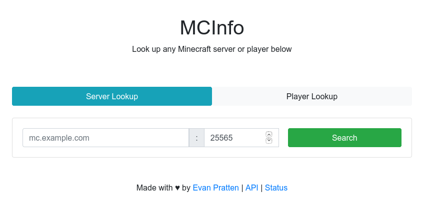
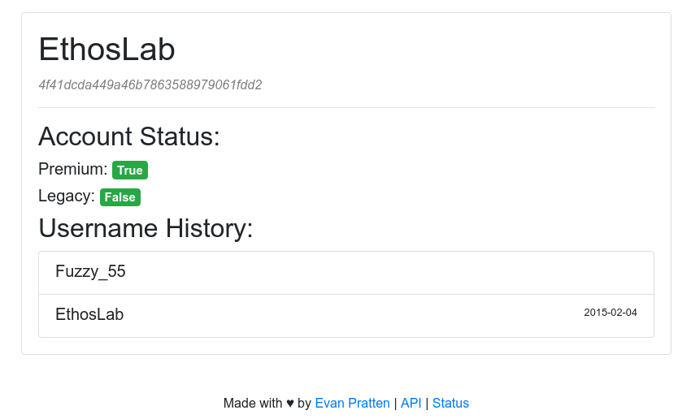

# MCInfo

MCInfo is a free-to-use web tool for viewing information about any public Minecraft server or player. Available at [mcinfo.retrylife.ca](https://mcinfo.retrylife.ca).

## Features

 - Servers
   - Server versions
   - Server capacity
   - Online players *
 - Players
   - Username history (with timestamps)
   - Account information
   - Account UID

***\*** Server must support this feature*

## Screenshots

*Search page*

*Player info*